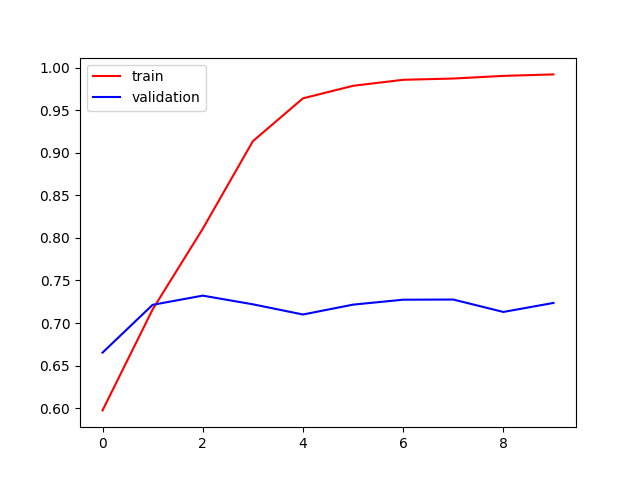
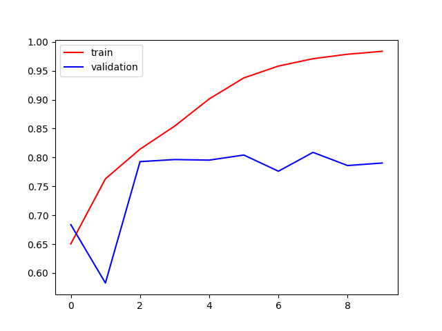
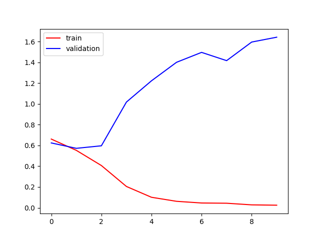
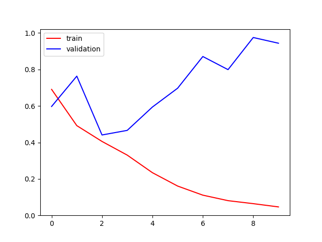
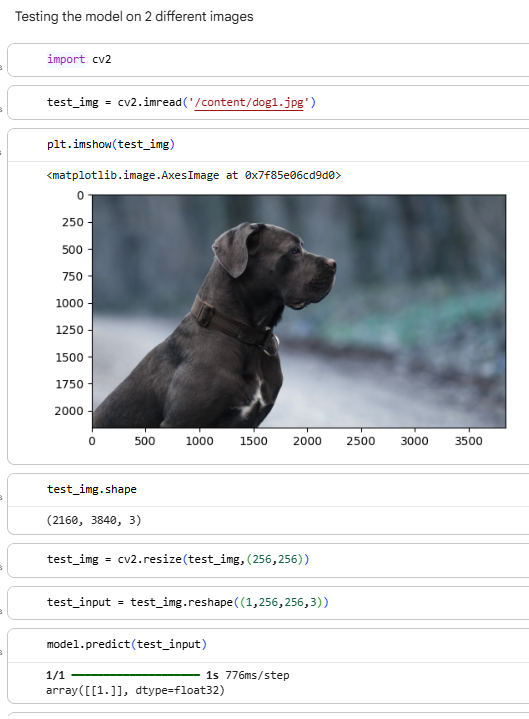
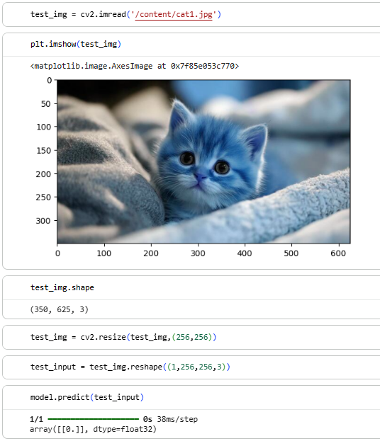

# Dogs🐶 and Cats😺 Classification using CNN Model

_Trained a model to classify the list of images into dogs and cats using convolutional neural network model._

---
## 📌Table of Contents
- <a href="#overview">Overview</a>
- <a href="#buisness-problem">Buisness Problem</a>
- <a href="#dataset">Dataset</a>
- <a href="#tools--technologies">Tools and Technologies</a>
- <a href="#project-structure">Project Structure</a>
- <a href="#model-architecture">Model Architecture</a>
- <a href="#training-process">Training Process</a>
- <a href="#results">Results</a>
- <a href="#how-to-run-this-project">How to Run This Project</a>
- <a href="#future-improvements">Future Improvements</a>
- <a href="#author--contact">Author & Contact</a>


---
<h2><a class="anchor" id="overview"></a>Overview</h2>

This project uses a CNN model built with TensorFlow/Keras to classify images of dogs and cats. The model is trained on image datasets and predicts whether an uploaded image belongs to a dog or a cat.

---
<h2><a class="anchor" id="buisness-problem"></a>Buisness Problem</h2>

Manually classifying large image datasets is time-consuming. This project automates pet image classification using deep learning techniques.

Possible real-world applications:

- Pet adoption platforms
- Animal recognition systems
- Image organization applications

---
<h2><a class="anchor" id="dataset"></a>Dataset</h2>

Dataset Link: https://www.kaggle.com/datasets/princelv84/dogsvscats

Dataset Structure:

- train/cats – 12,500 images
- train/dogs – 12,500 images
- test/cats – images for evaluation
- test/dogs – images for evaluation

---
<h2><a class="anchor" id="tools--technologies"></a>Tools & Technologies</h2>

- Google Colab
- Python
- Tensorflow 
- Keras
- OpenCV
- Matplotlib
- CNN
- GitHub

---
<h2><a class="anchor" id="project-structure"></a>Project Structure</h2>

```bash
dog-cat-classifier-cnn-model/
│
├── dataset/
│   ├── train/
│   └── test/
│
├── notebook/
│   └── dogsVScats_classification.ipynb
│
├── images/
│   ├── accuracy_before_reducing_overfitting.png
│   ├── accuracy_after_reducing_overfitting.png
│   ├── loss_before_reducing_overfitting.png
│   ├── loss_after_reducing_overfitting.png
│   ├── test_image_1.png
│   └── test_image_2.png
│
├── requirements.txt
└── README.md
```
---
<h2><a class="anchor" id="model-architecture"></a>Model Architecture</h2>

The CNN model consists of the following layers:

- Convolutional Layer (Conv2D)
- Activation Function (ReLU)
- Max Pooling Layer
- Flatten Layer
- Dense Layer
- Output Layer (Sigmoid)

Architecture Flow: Input Image → Conv2D → ReLU → MaxPooling → Flatten → Dense → Sigmoid Output

Model Details:

- Image Size: 256 × 256
- Number of Classes: 2 (Dog and Cat)
- Loss Function: Binary Crossentropy
- Optimizer: Adam
- Evaluation Metric: Accuracy

---
<h2><a class="anchor" id="training-process"></a>Training Process</h2>

The model was trained using image datasets of dogs and cats.

Steps Involved:

1. Loaded and preprocessed the dataset
2. Resized images to a fixed dimension
3. Normalized pixel values
4. Built the CNN model
5. Compiled the model using Adam optimizer and Binary Crossentropy loss
6. Trained the model on training data
7. Evaluated the model using validation data
8. Saved the trained model for future predictions

Training Details:

- Epochs: 10
- Batch Size: 32
- Optimizer: Adam
- Loss Function: Binary Crossentropy
- Metric Used: Accuracy

---
<h2><a class="anchor" id="results"></a>Results</h2>

The CNN model successfully classified images of dogs and cats with good accuracy.

Model Performance:

- Training Accuracy: 99.22%
- Validation Accuracy: 72.36%

Output Predictions:

The model is able to:
- Predict whether an image is a dog or a cat
- Classify custom uploaded images
- Provide accurate predictions on test images

Sample Outputs:

- Dog Image → Predicted as Dog
- Cat Image → Predicted as Cat

Output Screenshots:












---
<h2><a class="anchor" id="how-to-run-this-project"></a>How to Run This project</h2>

1. Clone the repository

```bash
git clone <your-github-repository-link>
```

2. Open the project folder

3. Open `dogsVScats_classification.ipynb` in:
   - Jupyter Notebook
   - VS Code
   - or Google Colab

4. Run all the cells step by step

5. Upload an image to test the model predictions

---
<h2><a class="anchor" id="future-improvements"></a>Future Improvements</h2>

- Improve model accuracy
- Reduce overfitting
- Use Transfer Learning models like VGG16 or ResNet
- Increase dataset size for better predictions
- Add support for multiple animal classifications
- Optimize the model performance
- Deploy the model as a web application in the future

---
<h2><a class="anchor" id="author--contact"></a>Author & Contact</h2>

**K Sri Gayatri**

📧Email: ksrigayatri2021@gmail.com

🔗[LinkedIn](https://www.linkedin.com/in/ksgayatri) Let's Connect & Grow Together! 

